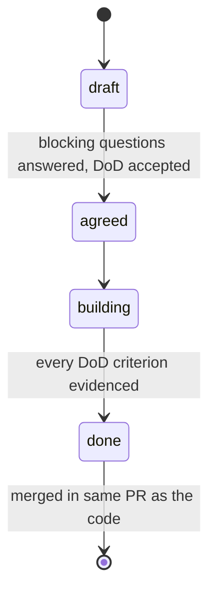
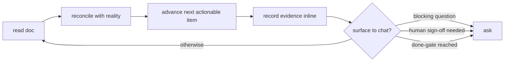

# Living-doc comm style — working notes

A `comms` feature that defines how the agent and human collaborate on **long-horizon work** by centering everything on one living markdown document instead of chat back-and-forth. The doc defines the work, holds the open questions, prefers diagrams over prose, and accumulates evidence of completeness until the whole thing is done and merged.

Governing constraint: **prescriptive enough that the agent doesn't burn tokens figuring out process, but not bureaucratic.** Resolving principle — the doc is updated as a *byproduct* of doing the work, never as a separate ceremony. Every section earns its place; evidence is a pointer or artifact, not an essay.

## Decisions locked

| # | Decision | Choice |
|---|----------|--------|
| 1 | Scope of one doc | **One doc = one feature.** Composing features into an epic (an orchestrator agent dispatching feature agents) is a **non-goal now** — explicitly out of scope, must not shape the design. |
| 2 | Evidence bar | **Per-criterion, declared in the DoD.** Pointers (file:line, commit) for some, test results for others, screenshots for UI. Not one-size. |
| 3 | Delivery | **Template file + slash command.** The command scaffolds and drives the doc, and may flip `comms` feature toggles on/off as part of a work session (that's what the toggle infra is for). |

## Evidence model (refinement — confirm)

Evidence anchors to **Definition of Done criteria**, not to every task.

- Tasks = cheap work-breakdown checklist, ticked freely as work proceeds.
- DoD = the gated acceptance list. Each row declares an evidence *type* at `agreed`, and carries the actual evidence when met.
- Done-gate = every DoD row has evidence.

This keeps rigor where it matters (acceptance) and keeps the tasks list friction-free.

## Document template (near-final)

★ = mandatory. Others are optional — omit the section if empty rather than writing "N/A".

- ★ **Meta** — slug, status (`draft｜agreed｜building｜done`), branch / PR link. One line.
- ★ **Goal** — 1–3 sentences. Why this work exists.
- ★ **Definition of Done** — table: `criterion ｜ evidence type ｜ evidence`. Evidence filled when met.
- **Open Questions** — table: `question ｜ status ｜ answer/decision`. Blocking questions gate the move to `building`.
- **Design** — diagrams-first (mermaid). Prose only for rationale/constraint a diagram can't carry.
- **Decisions** — append-only mini-ADR: choice + one-line why. Stops re-litigation.
- ★ **Tasks** — plain checklist, the work breakdown.
- **Out of Scope** — explicit non-goals (e.g. epic composition).

### Conventions

Task line — pointer, not narrative:
```markdown
- [x] Rate-limit middleware — `middleware/ratelimit.py:1`; commit abc123
- [ ] Wire into router
```

DoD item — a checkbox naming its evidence type, with the evidence indented beneath
(a table can't hold multi-line command output, code fences, or screenshot embeds):
```markdown
- [x] Requests over the limit get 429 — _evidence: test_
    ```
    tests/test_ratelimit.py 12/12 green
    ```
- [x] Settings page renders the new toggle — _evidence: screenshot_
    
- [x] Config documented — _evidence: pointer_ → `README.md:88`
```

Diagram rule — reach for mermaid when the thing is a **structure or sequence**: data model (`erDiagram`), flow (`flowchart`), states (`stateDiagram`), interaction (`sequenceDiagram`). Prose for tradeoffs and constraints. Never diagram a plain list.

## Lifecycle



The doc lives in-repo (e.g. `docs/work/<slug>.md`), commits alongside the code, and dies at merge.

## Agent protocol (the comm style)

The doc is the single source of truth. Prefer editing it over chatting. Each turn:



Surface to chat **only**: blocking questions, decisions needing human sign-off, done-gate reached. Don't ask what you can determine yourself. The Open Questions list is for genuine forks (irreversible, preference, ambiguous requirement) — not lookups.

## Command behavior (sketch)

Working name: `/worklog` (name TBD).

- `/worklog start <slug>` — scaffold `docs/work/<slug>.md` from the template, set status `draft`, optionally enable relevant `comms` features for the session.
- `/worklog` (no args) — resume: read the active doc, report status + next actionable item.
- Drives the per-turn protocol above.

Reuses the `comms` toggle infra: the command can flip specific features on/off rather than the feature being an always-on hook.

## Open micro-decisions — resolved

- [x] **Name** — `slog`. Deliberately avoids terms that collide with other contexts (`worklog`, `spec`, `ledger`).
- [x] **Protocol hook** — none. The `/slog` command's prompt carries the whole protocol; opt-in per task.
- [x] **Doc location** — `docs/work/<slug>.md`.
- [x] **Status transitions** — agent auto-advances the moment a gate is satisfied (no "may I advance?"). The `draft→agreed` gate still depends on the user answering blocking questions.

Built as: `plugins/comms/commands/slog.md` (driver + protocol), `plugins/comms/slog/template.md`, `plugins/comms/scripts/slog.sh` (scaffold + list). slog is a command, not a toggleable hook-feature, so it does not appear in `/comms:style list`.

## Non-goals

- Epic / multi-feature composition and orchestration.
- Replacing the existing `tlmforge:feature-development` spec workflow — this is the lightweight alternative.
