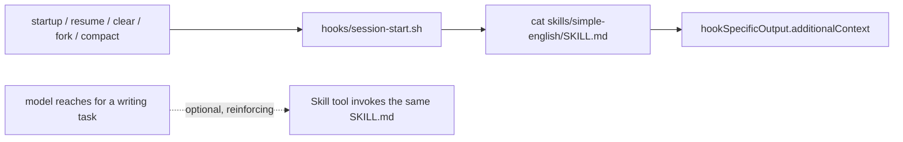

# simple-english

**Status:** building
**Branch/PR:** —

## Goal

Add a `simple-english` plugin based on ASD-STE100 Simplified Technical
English (short sentences, one word per meaning, active voice, no hedging
modals, condition before command). Unlike `bullets`/`checklist`, it
constrains wording and sentence construction, not reply structure — it
layers over whichever `comms` style is active rather than competing with it.
Reference implementation: [AminBlg/SimpleEnglish](https://github.com/AminBlg/SimpleEnglish).

## Definition of Done

- [x] `simple-english` plugin ships and applies from session start — _evidence: command_
    ```
    CLAUDE_PLUGIN_ROOT=.../plugins/simple-english sh hooks/session-start.sh
    → valid JSON, hookEventName: SessionStart, additionalContext: 2166 chars (well under the 10,000 cap)
    ```
- [x] Ruleset survives a compaction event, not just session start — _evidence: pointer_
    `plugins/simple-english/hooks/hooks.json:5` — matcher `startup|resume|clear|fork|compact` covers all 5 documented `SessionStart` triggers, `compact` included.
- [x] Composes with `bullets`/`checklist`/`default` without contradicting either — _evidence: pointer_
    By construction: separate plugin, separate event (`SessionStart` vs `comms`' `UserPromptSubmit`), no shared state or dispatcher — nothing to conflict.
- [x] Documented in README.md / CLAUDE.md alongside the other plugins — _evidence: pointer_
    `README.md` (`### \`simple-english\``), `CLAUDE.md` (`### \`simple-english\``)

## Decisions

- **Separate plugin, not a `comms` axis.** `comms`' redesign collapsed multi-axis complexity into one active-style file on purpose; a genuinely-independent boolean would undo that. Plugins already compose per-event without a shared dispatcher.
- **Delivery: `SessionStart` wired to all 5 matchers** (`startup|resume|clear|fork|compact`), not `UserPromptSubmit`. Checked against the official hooks docs, not assumed — see rationale below. No per-turn nag; this user's own global `CLAUDE.md` "Style Rules" section is the working precedent (loaded once, followed all session, never reinjected).
- **Rule set: condensed first.** Escalate to a fuller paraphrase only if the condensed set doesn't move output enough — user's explicit call, staged rather than one-shot.
- **Scope: applies broadly** (chat replies and written deliverables alike), not scoped to docs/commits/PRs only. Inferred, not stated outright: user is retiring `caveman` once this ships ("won't need it any more"), which only makes sense if this plugin takes over the general always-on register `caveman` used to own — not just a docs-only carve-out. The mechanism is ambient once loaded, so this required no extra scoping work either way. Flagging the inference here in case it's wrong.
- **No on/off toggle.** Ambient once installed — matches "ship it, retire caveman" rather than a situational switch. Can add one later if wanted; not built now (nothing asked for it).
- **One SKILL.md, two roles.** The ruleset lives at `skills/simple-english/SKILL.md`; the `SessionStart` hook just `cat`s it into `additionalContext`. Same file is also independently reachable as a model-invoked Skill (not `disable-model-invocation`), so the model can reach for it deliberately on a writing task, reinforcing the ambient copy. One source of truth, matches the real pattern found in `superpowers`' own `session-start` hook (checked, not assumed).

## Design

### Facts that shaped this (checked against docs, not assumed)

- `SessionStart` supports `hookSpecificOutput.additionalContext`, identically to `UserPromptSubmit`.
- `SessionStart` fires on 5 matchers: `startup`, `resume`, `clear`, `fork`, `compact`. The `compact` matcher exists specifically to **re-inject** content lost when the context window gets summarized — documented, supported, not a workaround.
- Hook `additionalContext` is capped at 10,000 characters per firing.
- Without `compact`, a one-time `SessionStart` injection *does* eventually get lost over a long session, same as ordinary transcript history. The reference repo's own premise ("session-start because the instructions are extensive") is only half the story without it.
- A bare "use ASD-STE100" name-drop does **not** suffice — the reference repo's own benchmark shows baseline agents told to write clearly/name the standard still wrote 40-word sentences and invented fake rule numbers. The actual rule text has to be in context.



## Tasks

- [x] Design agreed — mechanism, location, scope, rule-set staging all decided
- [x] `plugins/simple-english/.claude-plugin/plugin.json`
- [x] `plugins/simple-english/skills/simple-english/SKILL.md` — condensed ruleset
- [x] `plugins/simple-english/hooks/hooks.json` — `SessionStart`, 5 matchers
- [x] `plugins/simple-english/hooks/session-start.sh` — cats SKILL.md, JSON-escapes, emits envelope
- [x] Register in `.claude-plugin/marketplace.json`
- [x] Document in `README.md` and `CLAUDE.md`
- [x] Smoke-test: skill path — installed, reloaded, `/simple-english:simple-english` renders the exact SKILL.md content, correctly listed as `simple-english:simple-english`
- [ ] Smoke-test: `SessionStart` path — unverified in the session that did the install, since it predates the plugin (no `startup` fired for it); needs a fresh session, `/clear`, or a compaction to confirm auto-fire

## Out of Scope

- Full ASD-STE100 word-level vocabulary tables (the reference repo's `references/` dir) — only relevant if the rule set later escalates past "condensed."
- An on/off toggle or `comms`-style control command — not asked for; ambient-once-installed is the current design.
- Claude Code's native Output Styles feature (`/config` → Output style) — the reference repo also ships this as an alternative. Separate mechanism from this plugin's hook-based approach; not pursued unless later requested.
